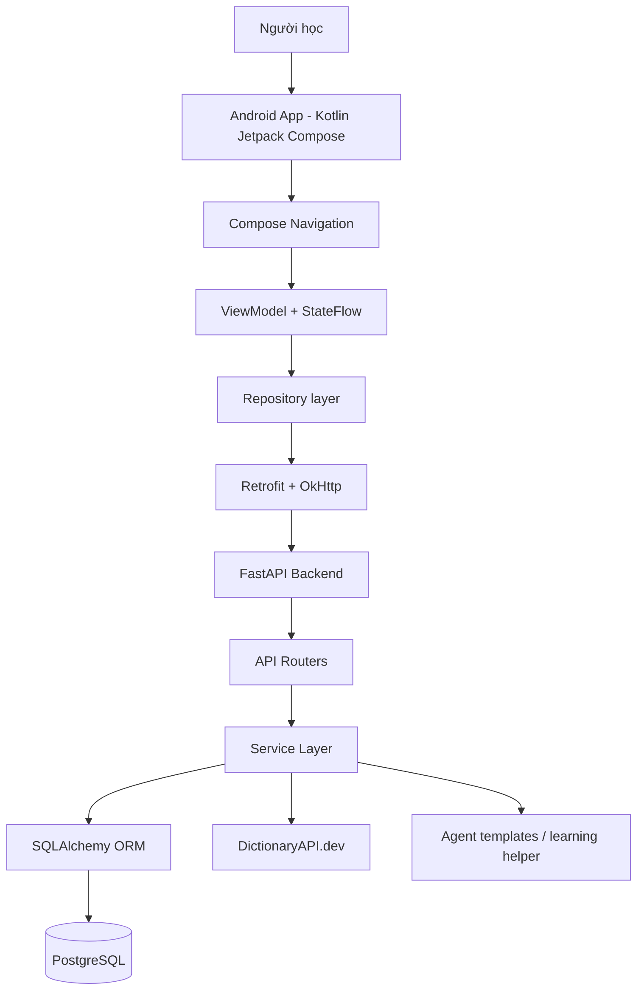
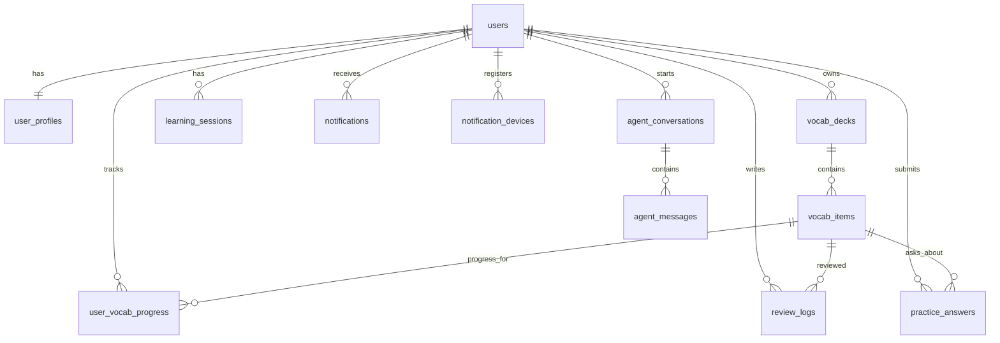

# Tài liệu phân tích dự án MinLish

> Ngày phân tích: 01/06/2026  
> Vai trò tài liệu: nội dung chuẩn bị PowerPoint cho business, manager, developer, tester, stakeholder và thành viên mới tham gia dự án.  
> Nguyên tắc: chỉ mô tả feature tìm thấy trong README/source code/test hiện tại. Các ý tưởng ngoài phạm vi code được ghi rõ là **Đề xuất / Có thể mở rộng**.

---

# 1. Tổng quan dự án

## Tên dự án

**MinLish**

MinLish là ứng dụng mobile-first giúp người dùng học và ghi nhớ từ vựng tiếng Anh thông qua deck từ vựng, flashcard, spaced repetition, quiz luyện tập, theo dõi tiến độ, nhắc học và trợ lý học tập dạng AI helper.

Nguồn kiểm chứng:

- [README.md](../README.md)
- [backend/README.md](../backend/README.md)
- [mobile/README.md](../mobile/README.md)

## Mục tiêu chính

- Giúp người học tiếng Anh xây dựng thói quen học từ vựng đều đặn.
- Cho phép người dùng tự tạo bộ từ vựng theo mục tiêu như IELTS, TOEIC, giao tiếp hoặc business English.
- Dùng thuật toán lặp lại ngắt quãng SM-2 để đưa từ cần ôn quay lại đúng thời điểm.
- Cung cấp dashboard tiến độ để người dùng thấy kết quả học tập.
- Hỗ trợ tra cứu từ qua DictionaryAPI.dev và lưu dữ liệu đã enrich vào hệ thống.
- Cung cấp trợ lý học tập đơn giản để giải thích từ, tạo ví dụ và gợi ý deck.

## Vấn đề dự án đang giải quyết

Người học từ vựng thường gặp các vấn đề:

- Ghi chép từ mới rời rạc, khó tổ chức theo chủ đề hoặc mục tiêu.
- Học nhiều nhưng quên nhanh vì không có lịch ôn tập khoa học.
- Không biết hôm nay nên học từ nào, ôn bao nhiêu từ là đủ.
- Khó theo dõi tiến bộ: đã học bao nhiêu từ, độ chính xác ra sao, còn bao nhiêu từ đến hạn ôn.
- Khi gặp từ mới, phải dùng nhiều công cụ khác nhau để tra nghĩa, ví dụ, collocation.

MinLish giải quyết bằng một vòng học khép kín:

```text
Đăng ký / đăng nhập
→ Thiết lập hồ sơ học tập
→ Tạo deck
→ Thêm từ
→ Học bằng flashcard
→ Đánh giá mức nhớ
→ Hệ thống tính lịch ôn SM-2
→ Theo dõi tiến độ
→ Nhận nhắc học / dùng AI helper khi cần
```

## Đối tượng người dùng

- Học sinh, sinh viên cần tích lũy từ vựng.
- Người học IELTS / TOEIC.
- Người đi làm muốn cải thiện tiếng Anh giao tiếp hoặc business English.
- Người mới bắt đầu xây dựng thói quen học tiếng Anh mỗi ngày.

## Giá trị mang lại cho người dùng / doanh nghiệp

| Nhóm giá trị | Mô tả |
| --- | --- |
| Giá trị học tập | Người dùng học từ mới, ôn lại đúng thời điểm, giảm quên lãng. |
| Giá trị vận hành | Backend quản lý dữ liệu tập trung, xác thực, phân quyền sở hữu dữ liệu theo user. |
| Giá trị sản phẩm | Có core loop rõ ràng, dễ demo, dễ phát triển tiếp thành sản phẩm học tập hoàn chỉnh. |
| Giá trị dữ liệu | Lưu review logs, progress, practice answers để phân tích hành vi học tập. |
| Giá trị mở rộng | Có nền tảng cho push notification, AI tutoring, offline cache, analytics nâng cao. |

## Phạm vi hiện tại của dự án

Dựa trên README, source code backend, mobile và test hiện tại, phạm vi đã có gồm:

- Backend FastAPI MVP.
- Android app Kotlin Jetpack Compose foundation.
- Đăng ký, đăng nhập, refresh token, logout phía client.
- Hồ sơ người học và kế hoạch học: mục tiêu, level, số từ mới/ngày, giới hạn review/ngày, giờ nhắc học.
- Deck CRUD.
- Vocabulary CRUD.
- Tra cứu từ bằng DictionaryAPI.dev.
- Tạo từ enriched từ dictionary hoặc fallback manual meaning.
- CSV import/export.
- Flashcard review với các rating: Again, Hard, Good, Easy.
- SM-2 scheduling.
- Learning session start/end.
- Dashboard progress: learned words, streak, accuracy, due reviews, level estimate, retention, daily activity, deck progress.
- Practice quiz multiple-choice từ vocabulary đã lưu.
- Practice history.
- Notification settings, register device placeholder, test notification record.
- AI word helper: explain word, generate examples, generate deck suggestions.

Nguồn kiểm chứng chính:

- Backend routers: [backend/main.py](../backend/main.py), [backend/auth/router.py](../backend/auth/router.py), [backend/decks/router.py](../backend/decks/router.py), [backend/vocabulary/router.py](../backend/vocabulary/router.py), [backend/learning/router.py](../backend/learning/router.py), [backend/progress/router.py](../backend/progress/router.py), [backend/practice/router.py](../backend/practice/router.py), [backend/notifications/router.py](../backend/notifications/router.py), [backend/agent/router.py](../backend/agent/router.py)
- Mobile navigation: [mobile/app/src/main/java/com/minlish/app/app/MinLishApp.kt](../mobile/app/src/main/java/com/minlish/app/app/MinLishApp.kt), [mobile/app/src/main/java/com/minlish/app/app/navigation/AppRoute.kt](../mobile/app/src/main/java/com/minlish/app/app/navigation/AppRoute.kt)

## Phạm vi chưa có hoặc có thể mở rộng trong tương lai

Các điểm sau được README ghi là planned/later hoặc chưa thấy triển khai production-ready trong source hiện tại:

| Hạng mục | Trạng thái hiện tại |
| --- | --- |
| Google login | Chưa tìm thấy trong source code hiện tại. README xếp P2. |
| Forgot password | Chưa tìm thấy trong source code hiện tại. Mobile README/README chính có nhắc planned later. |
| FCM push notification thật | Chưa có. Notification hiện mô phỏng bằng backend record. |
| Room/offline-first sync | Chưa có. Mobile có `DatabasePlaceholder`, backend là source of truth. |
| LLM provider thật | Chưa có. Agent hiện deterministic/structured, không cần paid API key. |
| Lưu generated deck thành deck thật bằng một endpoint | Chưa có. Mobile ghi rõ generated deck ideas là read-only. |
| Payment/community/teacher dashboard | Chưa có, README xếp P2/non-goal MVP. |
| Admin dashboard/web app | Chưa tìm thấy trong source code hiện tại. |
| Microservices/event-driven architecture | Không phải mục tiêu version đầu. |

---

# 2. Bối cảnh và lý do xây dựng hệ thống

## Vì sao cần hệ thống này?

Việc học từ vựng hiệu quả không chỉ là lưu từ mới, mà cần có vòng lặp học - ôn - đo lường - điều chỉnh. Nếu người dùng chỉ lưu từ trong note hoặc spreadsheet, họ thường không biết:

- Từ nào cần ôn hôm nay.
- Từ nào đã nhớ tốt.
- Từ nào hay sai.
- Mỗi ngày nên học bao nhiêu là hợp lý.
- Tiến độ học đang cải thiện hay đi xuống.

MinLish được xây dựng để biến quá trình học từ vựng thành một hệ thống có cấu trúc, cá nhân hóa và có dữ liệu đo lường.

## Người dùng hiện tại gặp khó khăn gì?

| Khó khăn | Tác động |
| --- | --- |
| Từ vựng phân tán ở nhiều nơi | Khó ôn tập, khó tìm lại, khó phân loại. |
| Không có lịch ôn thông minh | Dễ học trước quên sau. |
| Không có feedback tiến độ | Người học thiếu động lực vì không thấy kết quả. |
| Tra từ thủ công mất thời gian | Workflow học bị gián đoạn. |
| Không có quiz/ngữ cảnh ứng dụng | Người học nhớ mặt chữ nhưng khó dùng từ đúng. |

## Project giúp giải quyết các khó khăn đó như thế nào?

- Deck giúp gom từ theo topic/mục tiêu.
- Vocabulary item lưu meaning, pronunciation, example, collocations, synonyms, antonyms, note.
- Dictionary lookup tự động lấy dữ liệu cơ bản từ DictionaryAPI.dev.
- SM-2 tính lịch ôn dựa trên rating người dùng chọn sau mỗi flashcard.
- Daily plan gom số từ mới và số từ cần review trong ngày.
- Progress dashboard hiển thị learned words, streak, accuracy, due reviews, retention.
- Practice quiz tạo câu hỏi từ vocabulary đã lưu.
- AI helper giải thích từ theo level/goal của user và tạo ví dụ.
- Notification settings chuẩn bị nền cho nhắc học mỗi ngày.

## Các lợi ích chính khi sử dụng hệ thống

- **Dễ bắt đầu:** đăng ký, tạo deck, thêm từ và học ngay.
- **Dễ duy trì:** daily plan và reminder giúp tạo thói quen.
- **Dễ đo lường:** progress dashboard cho thấy kết quả học.
- **Dễ mở rộng:** backend module hóa theo domain, mobile chia repository/ViewModel/screen.
- **Có nền tảng dữ liệu:** review log, progress và practice history có thể dùng cho analytics nâng cao.

---

# 3. Danh sách use case chính

## Use Case 1: Đăng ký tài khoản

- **Mục tiêu:** tạo user mới bằng email/password và nhận JWT token để sử dụng app.
- **Actor / Người sử dụng:** người học mới.
- **Điều kiện bắt đầu:** user chưa có tài khoản; nhập email/password hợp lệ.
- **Luồng xử lý chính:**
  1. User mở màn hình Register.
  2. Nhập email, password, confirm password.
  3. Mobile kiểm tra password tối thiểu 8 ký tự và trùng confirmation.
  4. Mobile gọi `POST /auth/register`.
  5. Backend normalize email, kiểm tra trùng, hash password bằng bcrypt.
  6. Backend tạo `User` và `UserProfile` mặc định.
  7. Backend trả access token, refresh token và user info.
  8. Mobile lưu token vào DataStore.
- **Luồng thay thế / lỗi:**
  - Email đã tồn tại → backend trả `409 DUPLICATE_EMAIL`.
  - Password dưới 8 ký tự hoặc confirm mismatch → mobile báo lỗi local.
  - Request validation lỗi → backend trả `422 VALIDATION_ERROR`.
- **Kết quả đầu ra:** user có tài khoản và session đăng nhập.
- **Module / màn hình / API liên quan:**
  - Mobile: [AuthScreens.kt](../mobile/app/src/main/java/com/minlish/app/auth/ui/AuthScreens.kt), [AuthRepository.kt](../mobile/app/src/main/java/com/minlish/app/auth/data/AuthRepository.kt), [AuthTokenStore.kt](../mobile/app/src/main/java/com/minlish/app/core/datastore/AuthTokenStore.kt)
  - Backend: [auth/router.py](../backend/auth/router.py), [auth/service.py](../backend/auth/service.py), [config/security.py](../backend/config/security.py), [auth/models.py](../backend/auth/models.py), [users/models.py](../backend/users/models.py)
- **Giá trị mang lại:** onboarding user nhanh, bảo mật password, tạo nền tảng cá nhân hóa.

## Use Case 2: Đăng nhập, refresh token và logout

- **Mục tiêu:** xác thực user cũ, duy trì phiên bằng refresh token, cho phép thoát phiên.
- **Actor / Người sử dụng:** người học đã có tài khoản.
- **Điều kiện bắt đầu:** user có email/password hợp lệ.
- **Luồng xử lý chính:**
  1. User nhập email/password ở Login screen.
  2. Mobile gọi `POST /auth/login`.
  3. Backend verify password hash và trả token.
  4. Mobile lưu token vào DataStore.
  5. Mỗi request protected được OkHttp interceptor gắn `Authorization: Bearer <token>`.
  6. Nếu access token hết hạn, OkHttp authenticator gọi `POST /auth/refresh`.
  7. Logout gọi `POST /auth/logout`, sau đó client clear token.
- **Luồng thay thế / lỗi:**
  - Sai email/password → `401 INVALID_CREDENTIALS`.
  - Token thiếu/hết hạn/sai type → `401 UNAUTHORIZED`.
  - Logout hiện stateless; chưa có token revocation store.
- **Kết quả đầu ra:** user vào app hoặc bị đưa về signed-out state.
- **Module / màn hình / API liên quan:**
  - Mobile: [ApiClient.kt](../mobile/app/src/main/java/com/minlish/app/core/network/ApiClient.kt), [ApiService.kt](../mobile/app/src/main/java/com/minlish/app/core/network/ApiService.kt), [AppViewModels.kt](../mobile/app/src/main/java/com/minlish/app/app/AppViewModels.kt)
  - Backend: [auth/dependencies.py](../backend/auth/dependencies.py), [auth/router.py](../backend/auth/router.py), [auth/service.py](../backend/auth/service.py)
- **Giá trị mang lại:** bảo vệ dữ liệu học tập theo từng user và tạo trải nghiệm đăng nhập bền vững.

## Use Case 3: Thiết lập / cập nhật hồ sơ học tập

- **Mục tiêu:** thu thập thông tin cá nhân hóa learning plan.
- **Actor / Người sử dụng:** user mới hoặc user muốn thay đổi mục tiêu học.
- **Điều kiện bắt đầu:** user đã đăng nhập.
- **Luồng xử lý chính:**
  1. Sau đăng nhập, mobile gọi `/me`.
  2. Nếu profile thiếu `learning_goal` hoặc `english_level`, app chuyển sang ProfileSetupScreen.
  3. User nhập name, chọn goal, chọn level, daily new words, daily review limit, reminder time.
  4. Mobile gọi `PATCH /me/profile`.
  5. Backend cập nhật `user_profiles`.
  6. App refresh session và chuyển vào Home.
- **Luồng thay thế / lỗi:**
  - Request lỗi validation → hiển thị lỗi.
  - Profile không tồn tại → backend trả not found.
- **Kết quả đầu ra:** user có hồ sơ học tập hoàn chỉnh.
- **Module / màn hình / API liên quan:**
  - Mobile: [ProfileSetupScreen.kt](../mobile/app/src/main/java/com/minlish/app/onboarding/ui/ProfileSetupScreen.kt), [AppViewModels.kt](../mobile/app/src/main/java/com/minlish/app/app/AppViewModels.kt)
  - Backend: [users/router.py](../backend/users/router.py), [users/service.py](../backend/users/service.py), [users/models.py](../backend/users/models.py)
- **Giá trị mang lại:** cá nhân hóa kế hoạch học, reminder và nội dung agent theo mục tiêu/level.

## Use Case 4: Xem Home dashboard và kế hoạch hôm nay

- **Mục tiêu:** cho user thấy việc cần làm hôm nay và tiến độ tổng quan.
- **Actor / Người sử dụng:** người học đã đăng nhập và hoàn tất profile.
- **Điều kiện bắt đầu:** user mở Home.
- **Luồng xử lý chính:**
  1. HomeViewModel gọi song song `/me`, `/learning/daily-plan`, `/progress/summary`, `/decks`.
  2. App hiển thị greeting, số từ ready hôm nay, số từ mới, số review, learned words, streak, accuracy.
  3. User có thể chọn Review, Add word, Create deck, Ask AI.
- **Luồng thay thế / lỗi:**
  - API lỗi → Home hiển thị ErrorState và retry.
  - Chưa có deck → Add word bị disabled; gợi ý tạo deck.
- **Kết quả đầu ra:** user biết hôm nay cần học gì.
- **Module / màn hình / API liên quan:**
  - Mobile: [HomeScreen.kt](../mobile/app/src/main/java/com/minlish/app/home/ui/HomeScreen.kt), [AppViewModels.kt](../mobile/app/src/main/java/com/minlish/app/app/AppViewModels.kt)
  - Backend: [learning/service.py](../backend/learning/service.py), [progress/service.py](../backend/progress/service.py), [decks/service.py](../backend/decks/service.py)
- **Giá trị mang lại:** giảm friction, hướng user vào hành động học chính.

## Use Case 5: Quản lý deck từ vựng

- **Mục tiêu:** tạo, xem, sửa, xóa nhóm từ vựng theo chủ đề/mục tiêu.
- **Actor / Người sử dụng:** người học.
- **Điều kiện bắt đầu:** user đã đăng nhập.
- **Luồng xử lý chính:**
  1. User mở Decks tab.
  2. App gọi `GET /decks` và hiển thị danh sách.
  3. User tạo deck bằng name, description, tags.
  4. App gọi `POST /decks`.
  5. User mở deck detail, sửa hoặc xóa deck.
  6. Backend kiểm tra ownership bằng `user_id` trước khi trả/cập nhật/xóa.
- **Luồng thay thế / lỗi:**
  - User khác truy cập deck không thuộc sở hữu → `404 Deck not found`.
  - Xóa deck sẽ cascade xóa words/progress liên quan qua foreign key.
- **Kết quả đầu ra:** deck được quản lý theo user.
- **Module / màn hình / API liên quan:**
  - Mobile: [DeckScreens.kt](../mobile/app/src/main/java/com/minlish/app/deck/ui/DeckScreens.kt), [DeckRepository.kt](../mobile/app/src/main/java/com/minlish/app/deck/data/DeckRepository.kt)
  - Backend: [decks/router.py](../backend/decks/router.py), [decks/service.py](../backend/decks/service.py), [decks/models.py](../backend/decks/models.py)
- **Giá trị mang lại:** tổ chức từ vựng rõ ràng, phù hợp học theo mục tiêu.

## Use Case 6: Thêm và quản lý vocabulary item thủ công

- **Mục tiêu:** lưu từ vựng vào deck bằng dữ liệu người dùng nhập.
- **Actor / Người sử dụng:** người học.
- **Điều kiện bắt đầu:** có ít nhất một deck.
- **Luồng xử lý chính:**
  1. User vào Deck Detail → Add word.
  2. Nhập word, meaning, pronunciation, example, collocations, related words, note.
  3. Mobile gọi `POST /decks/{deck_id}/words`.
  4. Backend kiểm tra deck thuộc user.
  5. Backend tạo `VocabItem`.
  6. Backend tự tạo `UserVocabProgress` mặc định cho từ đó.
- **Luồng thay thế / lỗi:**
  - Thiếu word hoặc meaning → validation lỗi.
  - Deck không thuộc user → not found.
- **Kết quả đầu ra:** từ được lưu và xuất hiện trong queue học vì progress `due_at` mặc định là hiện tại.
- **Module / màn hình / API liên quan:**
  - Mobile: [VocabularyScreens.kt](../mobile/app/src/main/java/com/minlish/app/vocabulary/ui/VocabularyScreens.kt)
  - Backend: [vocabulary/router.py](../backend/vocabulary/router.py), [vocabulary/service.py](../backend/vocabulary/service.py), [vocabulary/models.py](../backend/vocabulary/models.py), [learning/models.py](../backend/learning/models.py)
- **Giá trị mang lại:** user tự xây dựng kho từ vựng cá nhân.

## Use Case 7: Tra cứu dictionary và lưu từ enriched

- **Mục tiêu:** giảm công nhập liệu bằng cách lấy nghĩa/phát âm/từ loại/ví dụ/synonym/antonym từ DictionaryAPI.dev.
- **Actor / Người sử dụng:** người học.
- **Điều kiện bắt đầu:** user đang thêm từ vào deck.
- **Luồng xử lý chính:**
  1. User nhập word và chọn Look up word.
  2. Mobile gọi `POST /words/lookup`.
  3. Backend gọi DictionaryAPI.dev qua `DictionaryClient`.
  4. Backend normalize response thành `DictionaryWord`.
  5. Mobile pre-fill form với dictionary result.
  6. User chỉnh sửa nếu cần và bấm Save.
  7. Mobile gọi `POST /decks/{deck_id}/words/enrich`.
  8. Backend lưu `VocabItem` với `source = dictionaryapi.dev` hoặc manual fallback.
- **Luồng thay thế / lỗi:**
  - Dictionary timeout → `EXTERNAL_DICTIONARY_TIMEOUT`.
  - Không tìm thấy từ → `WORD_NOT_FOUND`.
  - Enrich thất bại nhưng user có meaning thủ công → vẫn tạo word manual.
  - Enrich thất bại và không có meaning → validation/bad request.
- **Kết quả đầu ra:** vocabulary item giàu metadata hơn manual entry.
- **Module / màn hình / API liên quan:**
  - Backend: [vocabulary/dictionary_client.py](../backend/vocabulary/dictionary_client.py), [vocabulary/service.py](../backend/vocabulary/service.py)
  - Mobile: [VocabularyScreens.kt](../mobile/app/src/main/java/com/minlish/app/vocabulary/ui/VocabularyScreens.kt)
- **Giá trị mang lại:** tăng tốc nhập liệu, nâng chất lượng nội dung học.

## Use Case 8: Import / export CSV

- **Mục tiêu:** đưa danh sách từ vào/ra hệ thống bằng file CSV.
- **Actor / Người sử dụng:** người học, tester, người trình bày demo.
- **Điều kiện bắt đầu:** user có deck.
- **Luồng xử lý chính:**
  1. User mở Deck Detail.
  2. Import: chọn file CSV qua Android document picker.
  3. Mobile upload multipart tới `POST /decks/{deck_id}/import`.
  4. Backend đọc CSV UTF-8, yêu cầu cột `word` và `meaning`.
  5. Backend tạo từng word hợp lệ, trả imported/skipped/errors.
  6. Export: mobile gọi `GET /decks/{deck_id}/export`, nhận CSV text và mở share sheet.
- **Luồng thay thế / lỗi:**
  - CSV thiếu cột bắt buộc → report skipped/error.
  - Row thiếu word/meaning → row bị skip.
  - File không UTF-8 → error report.
- **Kết quả đầu ra:** dữ liệu từ vựng được import/export.
- **Module / màn hình / API liên quan:**
  - Backend: [vocabulary/import_export.py](../backend/vocabulary/import_export.py), [vocabulary/router.py](../backend/vocabulary/router.py)
  - Mobile: [DeckScreens.kt](../mobile/app/src/main/java/com/minlish/app/deck/ui/DeckScreens.kt), [MinLishApp.kt](../mobile/app/src/main/java/com/minlish/app/app/MinLishApp.kt)
- **Giá trị mang lại:** thuận tiện cho demo, migration dữ liệu và quản lý danh sách từ hàng loạt.

## Use Case 9: Học flashcard và review bằng SM-2

- **Mục tiêu:** user ôn các từ đến hạn và hệ thống tính lịch ôn tiếp theo.
- **Actor / Người sử dụng:** người học.
- **Điều kiện bắt đầu:** có vocabulary item với `due_at <= now`.
- **Luồng xử lý chính:**
  1. User bấm Review/Learn.
  2. Mobile gọi `GET /learning/due-words`.
  3. Nếu có từ, mobile gọi `POST /learning/session/start`.
  4. Flashcard hiển thị mặt trước: word, part of speech, phonetic.
  5. User tap để lật card xem meaning/example/note.
  6. User chọn Again/Hard/Good/Easy.
  7. Mobile gọi `POST /learning/review` với `vocab_item_id` và `rating`.
  8. Backend gọi `calculate_sm2`, cập nhật progress và ghi `ReviewLog`.
  9. Mobile chuyển sang card tiếp theo.
  10. Khi hoàn tất, mobile gọi `POST /learning/session/end`.
- **Luồng thay thế / lỗi:**
  - Không có due words → EmptyState “All caught up”.
  - User review word của user khác → not found.
  - Rating invalid → validation lỗi.
- **Kết quả đầu ra:** progress cập nhật, due date mới, review log và session summary được lưu.
- **Module / màn hình / API liên quan:**
  - Mobile: [FlashcardScreen.kt](../mobile/app/src/main/java/com/minlish/app/learning/ui/FlashcardScreen.kt), [LearningRepository.kt](../mobile/app/src/main/java/com/minlish/app/learning/data/LearningRepository.kt), [AppViewModels.kt](../mobile/app/src/main/java/com/minlish/app/app/AppViewModels.kt)
  - Backend: [learning/router.py](../backend/learning/router.py), [learning/service.py](../backend/learning/service.py), [srs/sm2.py](../backend/srs/sm2.py), [learning/models.py](../backend/learning/models.py)
- **Giá trị mang lại:** core learning loop giúp người dùng nhớ lâu hơn.

## Use Case 10: Theo dõi progress và retention

- **Mục tiêu:** cung cấp góc nhìn định lượng về việc học.
- **Actor / Người sử dụng:** người học, manager/stakeholder khi demo.
- **Điều kiện bắt đầu:** user đã có review logs hoặc progress.
- **Luồng xử lý chính:**
  1. User mở Progress tab.
  2. Mobile gọi `/progress/summary`, `/progress/retention`, `/progress/daily-activity`, `/decks` và `/progress/decks/{deck_id}`.
  3. Backend tổng hợp từ `UserVocabProgress` và `ReviewLog`.
  4. Mobile hiển thị learned words, streak, accuracy, due reviews, estimated level, chart hoạt động 7 ngày, retention, deck progress.
- **Luồng thay thế / lỗi:**
  - Chưa có dữ liệu → chart/dashboards hiển thị empty state hoặc 0.
  - Deck progress lỗi cho một deck → mobile bỏ qua deck đó trong mapNotNull.
- **Kết quả đầu ra:** user hiểu tiến độ và chất lượng ghi nhớ.
- **Module / màn hình / API liên quan:**
  - Mobile: [ProgressDashboardScreen.kt](../mobile/app/src/main/java/com/minlish/app/progress/ui/ProgressDashboardScreen.kt), [ProgressRepository.kt](../mobile/app/src/main/java/com/minlish/app/progress/data/ProgressRepository.kt)
  - Backend: [progress/router.py](../backend/progress/router.py), [progress/service.py](../backend/progress/service.py)
- **Giá trị mang lại:** tăng động lực học và cung cấp dữ liệu cho cải tiến sản phẩm.

## Use Case 11: Practice quiz và xem lịch sử luyện tập

- **Mục tiêu:** kiểm tra khả năng nhớ nghĩa từ bằng câu hỏi trắc nghiệm.
- **Actor / Người sử dụng:** người học.
- **Điều kiện bắt đầu:** user đã có vocabulary items.
- **Luồng xử lý chính:**
  1. User vào Settings → Practice quiz hoặc route Practice.
  2. Bấm Generate 5 questions.
  3. Mobile gọi `POST /practice/generate`.
  4. Backend lấy từ của user, tạo câu hỏi `What is the meaning of 'word'?` và options gồm đáp án đúng + distractors.
  5. User chọn đáp án.
  6. Mobile gọi `POST /practice/submit`.
  7. Backend so sánh answer với meaning, lưu `PracticeAnswer`, trả feedback.
  8. User xem kết quả hoặc mở Practice history.
- **Luồng thay thế / lỗi:**
  - Chưa có words → EmptyState “Add words before practicing”.
  - Answer cho word không thuộc user → not found.
- **Kết quả đầu ra:** câu trả lời được lưu, có feedback đúng/sai và lịch sử.
- **Module / màn hình / API liên quan:**
  - Mobile: [PracticeScreens.kt](../mobile/app/src/main/java/com/minlish/app/practice/ui/PracticeScreens.kt), [PracticeRepository.kt](../mobile/app/src/main/java/com/minlish/app/practice/data/PracticeRepository.kt)
  - Backend: [practice/router.py](../backend/practice/router.py), [practice/service.py](../backend/practice/service.py), [practice/models.py](../backend/practice/models.py)
- **Giá trị mang lại:** chuyển từ học thụ động sang kiểm tra chủ động.

## Use Case 12: Cấu hình notification và test reminder

- **Mục tiêu:** lưu cài đặt nhắc học và chuẩn bị nền tảng push notification.
- **Actor / Người sử dụng:** người học.
- **Điều kiện bắt đầu:** user đã đăng nhập.
- **Luồng xử lý chính:**
  1. User mở Settings → Notification settings.
  2. Bật/tắt daily reminders.
  3. Chọn reminder time qua TimePicker.
  4. Mobile gọi `PATCH /notifications/settings`.
  5. User có thể register placeholder Android device.
  6. User bấm Send test notification.
  7. Backend tạo record `Notification` status pending.
- **Luồng thay thế / lỗi:**
  - Push delivery thật chưa cấu hình; test chỉ lưu backend notification record.
  - Device token placeholder không phải FCM token thật.
- **Kết quả đầu ra:** notification settings/profile được cập nhật, device/test notification được lưu.
- **Module / màn hình / API liên quan:**
  - Mobile: [NotificationSettingsScreen.kt](../mobile/app/src/main/java/com/minlish/app/notifications/ui/NotificationSettingsScreen.kt), [NotificationRepository.kt](../mobile/app/src/main/java/com/minlish/app/notifications/data/NotificationRepository.kt)
  - Backend: [notifications/router.py](../backend/notifications/router.py), [notifications/service.py](../backend/notifications/service.py), [notifications/models.py](../backend/notifications/models.py)
- **Giá trị mang lại:** tăng khả năng duy trì thói quen học; tạo nền cho FCM production.

## Use Case 13: AI word helper - giải thích từ

- **Mục tiêu:** giải thích từ theo level và learning goal của user.
- **Actor / Người sử dụng:** người học.
- **Điều kiện bắt đầu:** user đã đăng nhập; nhập word.
- **Luồng xử lý chính:**
  1. User mở AI word helper hoặc từ Word Detail bấm Ask AI.
  2. Mobile gọi `POST /agent/explain-word`.
  3. Backend đọc profile context: level, goal, daily target.
  4. Backend thử lookup dictionary.
  5. Nếu dictionary fail, backend tìm word local của user.
  6. Backend trả explanation, examples và collocations theo template.
- **Luồng thay thế / lỗi:**
  - Dictionary fail và không có local word → trả lỗi từ dictionary.
  - Đây chưa phải chatbot LLM tự do; response deterministic/structured.
- **Kết quả đầu ra:** user nhận giải thích và ví dụ dễ hiểu.
- **Module / màn hình / API liên quan:**
  - Mobile: [AgentScreens.kt](../mobile/app/src/main/java/com/minlish/app/agent/ui/AgentScreens.kt), [AgentRepository.kt](../mobile/app/src/main/java/com/minlish/app/agent/data/AgentRepository.kt)
  - Backend: [agent/router.py](../backend/agent/router.py), [agent/service.py](../backend/agent/service.py), [agent/prompts.py](../backend/agent/prompts.py)
- **Giá trị mang lại:** giúp user hiểu từ trong ngữ cảnh học cá nhân.

## Use Case 14: AI generate examples

- **Mục tiêu:** tạo nhiều câu ví dụ cho một từ.
- **Actor / Người sử dụng:** người học.
- **Điều kiện bắt đầu:** user nhập word.
- **Luồng xử lý chính:**
  1. User mở Generate examples.
  2. Mobile gọi `POST /agent/generate-examples`.
  3. Backend gọi lại logic explain word.
  4. Backend trả các examples theo count, level, goal.
- **Luồng thay thế / lỗi:**
  - Nếu dictionary/local lookup lỗi → API trả lỗi.
  - Nội dung ví dụ bổ sung hiện là template deterministic.
- **Kết quả đầu ra:** danh sách ví dụ phù hợp mục tiêu học.
- **Module / màn hình / API liên quan:**
  - Mobile: [AgentScreens.kt](../mobile/app/src/main/java/com/minlish/app/agent/ui/AgentScreens.kt)
  - Backend: [agent/service.py](../backend/agent/service.py)
- **Giá trị mang lại:** tăng khả năng dùng từ trong câu.

## Use Case 15: AI generate deck suggestions

- **Mục tiêu:** gợi ý danh sách từ theo topic như IELTS/Business.
- **Actor / Người sử dụng:** người học.
- **Điều kiện bắt đầu:** user nhập topic.
- **Luồng xử lý chính:**
  1. User mở Generate deck ideas.
  2. Mobile gọi `POST /agent/generate-deck`.
  3. Backend lấy topic, level, goal và daily target.
  4. Backend lấy từ trong `TOPIC_WORDS`, giới hạn theo daily target/limit.
  5. Mobile hiển thị word suggestions và reason.
- **Luồng thay thế / lỗi:**
  - Topic không có trong map → backend fallback về `ielts` words.
  - Generated deck hiện read-only; chưa có endpoint lưu thành deck một lần.
- **Kết quả đầu ra:** user có ý tưởng học theo topic.
- **Module / màn hình / API liên quan:**
  - Mobile: [AgentScreens.kt](../mobile/app/src/main/java/com/minlish/app/agent/ui/AgentScreens.kt)
  - Backend: [agent/service.py](../backend/agent/service.py), [agent/prompts.py](../backend/agent/prompts.py)
- **Giá trị mang lại:** giúp user nhanh chóng có nội dung học mới.

---

# 4. User Journey / Luồng trải nghiệm người dùng

## Journey chính: từ người dùng mới đến hoàn thành phiên học

```text
Người dùng mở ứng dụng
→ Chưa có token: xem Login/Register
→ Đăng ký tài khoản
→ Backend tạo user + profile mặc định
→ App lưu token bằng DataStore
→ App gọi /me
→ Profile chưa hoàn chỉnh: mở màn hình thiết lập kế hoạch học
→ User chọn goal, level, daily target, reminder time
→ Vào Home
→ Tạo deck đầu tiên
→ Thêm từ thủ công hoặc lookup dictionary rồi lưu
→ Vào Learn/Review
→ Lật flashcard
→ Chọn Again/Hard/Good/Easy
→ Backend cập nhật SM-2 progress và review log
→ Hoàn tất session
→ Mở Progress xem learned words, streak, accuracy, retention
→ Có thể vào Practice quiz hoặc AI word helper để học sâu hơn
```

## Journey user quay lại mỗi ngày

```text
Người dùng mở app
→ Token còn hiệu lực hoặc được refresh tự động
→ Home tải daily plan
→ User thấy số từ cần review
→ Bấm Review now
→ Hoàn thành flashcard queue
→ Progress dashboard cập nhật
→ User có thể thêm từ mới hoặc làm quiz
```

## Journey quản lý nội dung học

```text
Mở Decks
→ Tìm deck hoặc tạo deck mới
→ Mở Deck Detail
→ Thêm / sửa / xóa word
→ Import CSV nếu có danh sách sẵn
→ Export CSV nếu cần chia sẻ/sao lưu
→ Start learning từ deck
```

---

# 5. Thiết kế chức năng theo module

## Module 1: Auth

- **Vai trò:** xác thực user, phát hành JWT, quản lý đăng nhập/đăng ký/refresh/logout.
- **Chức năng chính:** register, login, refresh token, logout stateless, get current user dependency.
- **Input / Output:**
  - Input: email, password, refresh token, bearer token.
  - Output: access token, refresh token, user info, auth error.
- **Các class/file liên quan:**
  - Backend: [backend/auth/router.py](../backend/auth/router.py), [backend/auth/service.py](../backend/auth/service.py), [backend/auth/models.py](../backend/auth/models.py), [backend/auth/schemas.py](../backend/auth/schemas.py), [backend/auth/dependencies.py](../backend/auth/dependencies.py), [backend/config/security.py](../backend/config/security.py)
  - Mobile: [mobile/app/src/main/java/com/minlish/app/auth/ui/AuthScreens.kt](../mobile/app/src/main/java/com/minlish/app/auth/ui/AuthScreens.kt), [mobile/app/src/main/java/com/minlish/app/auth/data/AuthRepository.kt](../mobile/app/src/main/java/com/minlish/app/auth/data/AuthRepository.kt)
- **Tương tác với module khác:** User/Profile, tất cả protected API.
- **Luồng xử lý bên trong:** request → router → service → DB/User → security helper → response token.

## Module 2: User Profile / Onboarding

- **Vai trò:** lưu cấu hình học cá nhân của user.
- **Chức năng chính:** get `/me`, update profile, xác định profile hoàn chỉnh trên mobile.
- **Input / Output:** name, learning goal, English level, daily new words, review limit, notification time, timezone.
- **Các class/file liên quan:**
  - Backend: [backend/users/router.py](../backend/users/router.py), [backend/users/service.py](../backend/users/service.py), [backend/users/models.py](../backend/users/models.py)
  - Mobile: [ProfileSetupScreen.kt](../mobile/app/src/main/java/com/minlish/app/onboarding/ui/ProfileSetupScreen.kt), [AppViewModels.kt](../mobile/app/src/main/java/com/minlish/app/app/AppViewModels.kt)
- **Tương tác:** Learning daily plan, notifications, agent context.
- **Luồng xử lý:** AppStateViewModel gọi `/me` → nếu thiếu goal/level thì NeedsProfile → lưu profile → refresh session.

## Module 3: Decks

- **Vai trò:** quản lý nhóm từ vựng.
- **Chức năng chính:** list, create, get detail, update, delete deck.
- **Input / Output:** deck name, description, tags; trả về deck DTO.
- **File liên quan:** [backend/decks](../backend/decks), [DeckScreens.kt](../mobile/app/src/main/java/com/minlish/app/deck/ui/DeckScreens.kt), [DeckRepository.kt](../mobile/app/src/main/java/com/minlish/app/deck/data/DeckRepository.kt)
- **Tương tác:** Vocabulary, progress deck, import/export, learning.
- **Luồng xử lý:** mobile repository → API `/decks` → service kiểm tra `user_id` → SQLAlchemy model `VocabDeck`.

## Module 4: Vocabulary

- **Vai trò:** quản lý từng từ vựng trong deck.
- **Chức năng chính:** CRUD word, dictionary lookup, enriched save, import/export CSV.
- **Input / Output:** word, meaning, pronunciation, example, collocations, related words, note, part of speech, phonetic, audio URL, synonyms, antonyms, source.
- **File liên quan:** [backend/vocabulary](../backend/vocabulary), [VocabularyScreens.kt](../mobile/app/src/main/java/com/minlish/app/vocabulary/ui/VocabularyScreens.kt), [VocabularyRepository.kt](../mobile/app/src/main/java/com/minlish/app/vocabulary/data/VocabularyRepository.kt)
- **Tương tác:** Deck ownership, Learning progress, DictionaryAPI.dev.
- **Luồng xử lý:** create word → tạo `VocabItem` → tạo `UserVocabProgress` mặc định → word vào due queue.

## Module 5: Learning / SRS

- **Vai trò:** core learning loop bằng flashcard và SM-2.
- **Chức năng chính:** daily plan, due words, review, start/end session.
- **Input / Output:** rating `again/hard/good/easy`, session stats, due words.
- **File liên quan:** [backend/learning](../backend/learning), [backend/srs/sm2.py](../backend/srs/sm2.py), [FlashcardScreen.kt](../mobile/app/src/main/java/com/minlish/app/learning/ui/FlashcardScreen.kt), [LearningRepository.kt](../mobile/app/src/main/java/com/minlish/app/learning/data/LearningRepository.kt)
- **Tương tác:** Vocabulary, Progress, Profile.
- **Luồng xử lý:** due queue → flashcard → rating → SM-2 result → progress/log/session update.

## Module 6: Progress

- **Vai trò:** tổng hợp dữ liệu học tập để hiển thị dashboard.
- **Chức năng chính:** summary, daily activity, retention, deck progress.
- **Input / Output:** dữ liệu từ progress/log; trả learned words, streak, accuracy, due count, level estimate.
- **File liên quan:** [backend/progress](../backend/progress), [ProgressDashboardScreen.kt](../mobile/app/src/main/java/com/minlish/app/progress/ui/ProgressDashboardScreen.kt), [ProgressRepository.kt](../mobile/app/src/main/java/com/minlish/app/progress/data/ProgressRepository.kt)
- **Tương tác:** Learning progress/log, Decks.
- **Luồng xử lý:** query `UserVocabProgress` + `ReviewLog` → aggregate → DTO → UI chart/stat cards.

## Module 7: Practice

- **Vai trò:** luyện tập kiểm tra nghĩa từ.
- **Chức năng chính:** generate quiz, submit answer, history.
- **Input / Output:** limit, vocab item id, user answer; output questions/options/feedback/history.
- **File liên quan:** [backend/practice](../backend/practice), [PracticeScreens.kt](../mobile/app/src/main/java/com/minlish/app/practice/ui/PracticeScreens.kt), [PracticeRepository.kt](../mobile/app/src/main/java/com/minlish/app/practice/data/PracticeRepository.kt)
- **Tương tác:** Vocabulary ownership, PracticeAnswer DB.
- **Luồng xử lý:** lấy words user sở hữu → tạo options → submit → lưu correct/wrong + feedback.

## Module 8: Notifications

- **Vai trò:** lưu thiết lập nhắc học và thiết bị.
- **Chức năng chính:** register device, update settings, test notification.
- **Input / Output:** platform, device token, enabled, time, timezone; output device/settings/notification record.
- **File liên quan:** [backend/notifications](../backend/notifications), [NotificationSettingsScreen.kt](../mobile/app/src/main/java/com/minlish/app/notifications/ui/NotificationSettingsScreen.kt), [NotificationRepository.kt](../mobile/app/src/main/java/com/minlish/app/notifications/data/NotificationRepository.kt)
- **Tương tác:** User profile, future push provider.
- **Luồng xử lý:** settings update profile → test tạo Notification status pending.

## Module 9: Agent / AI Helper

- **Vai trò:** trợ lý học tập đơn giản, trả JSON có cấu trúc cho mobile.
- **Chức năng chính:** explain word, generate examples, generate deck suggestions.
- **Input / Output:** word/topic/count/deck_id; output explanation/examples/suggestions.
- **File liên quan:** [backend/agent](../backend/agent), [AgentScreens.kt](../mobile/app/src/main/java/com/minlish/app/agent/ui/AgentScreens.kt), [AgentRepository.kt](../mobile/app/src/main/java/com/minlish/app/agent/data/AgentRepository.kt)
- **Tương tác:** Profile context, DictionaryAPI.dev, local vocabulary.
- **Luồng xử lý:** request → verify deck nếu có → lấy profile context → dictionary/local lookup/template → structured response.

## Module 10: Shared / Infrastructure

- **Vai trò:** cấu hình, DB session, error handling, datetime, pagination/permission helpers.
- **Chức năng chính:** FastAPI app wiring, SQLAlchemy/Alembic, settings env, validation error envelope.
- **File liên quan:** [backend/main.py](../backend/main.py), [backend/config](../backend/config), [backend/database](../backend/database), [backend/shared](../backend/shared), [docker-compose.yml](../docker-compose.yml)
- **Tương tác:** tất cả backend modules.
- **Luồng xử lý:** FastAPI include router → dependency DB/session/user → service → SQLAlchemy → PostgreSQL.

---

# 6. Thiết kế kiến trúc hệ thống

## Kiến trúc tổng thể full-stack

MinLish dùng kiến trúc client-server đơn giản:



## Mobile architecture

```text
Composable Screen
→ ViewModel
→ Repository
→ ApiClient / ApiService
→ FastAPI Backend
→ PostgreSQL
```

### UI / Composable

- Mỗi màn hình chính là một Composable function.
- Dùng Material 3, Compose Navigation, custom shared components.
- File liên quan:
  - [AuthScreens.kt](../mobile/app/src/main/java/com/minlish/app/auth/ui/AuthScreens.kt)
  - [HomeScreen.kt](../mobile/app/src/main/java/com/minlish/app/home/ui/HomeScreen.kt)
  - [DeckScreens.kt](../mobile/app/src/main/java/com/minlish/app/deck/ui/DeckScreens.kt)
  - [VocabularyScreens.kt](../mobile/app/src/main/java/com/minlish/app/vocabulary/ui/VocabularyScreens.kt)
  - [FlashcardScreen.kt](../mobile/app/src/main/java/com/minlish/app/learning/ui/FlashcardScreen.kt)
  - [ProgressDashboardScreen.kt](../mobile/app/src/main/java/com/minlish/app/progress/ui/ProgressDashboardScreen.kt)
  - [PracticeScreens.kt](../mobile/app/src/main/java/com/minlish/app/practice/ui/PracticeScreens.kt)
  - [NotificationSettingsScreen.kt](../mobile/app/src/main/java/com/minlish/app/notifications/ui/NotificationSettingsScreen.kt)
  - [AgentScreens.kt](../mobile/app/src/main/java/com/minlish/app/agent/ui/AgentScreens.kt)

### UI State

- Dùng `UiState`: Idle, Loading, Empty, Error, Success.
- Auth dùng `AuthFormState`, settings dùng `SettingsData`, agent dùng `AgentData`.
- File chính: [AppViewModels.kt](../mobile/app/src/main/java/com/minlish/app/app/AppViewModels.kt), [ApiResult.kt](../mobile/app/src/main/java/com/minlish/app/core/network/ApiResult.kt)

### ViewModel

- ViewModel giữ StateFlow và gọi repository.
- Các ViewModel chính: `AppStateViewModel`, `AuthViewModel`, `ProfileViewModel`, `HomeViewModel`, `DeckViewModel`, `LearningViewModel`, `ProgressViewModel`, `PracticeViewModel`, `SettingsViewModel`, `AgentViewModel`.
- File chính: [AppViewModels.kt](../mobile/app/src/main/java/com/minlish/app/app/AppViewModels.kt)

### Repository

- Repository bọc ApiClient và dùng `safeApiCall`.
- File liên quan: [auth/data](../mobile/app/src/main/java/com/minlish/app/auth/data), [deck/data](../mobile/app/src/main/java/com/minlish/app/deck/data), [vocabulary/data](../mobile/app/src/main/java/com/minlish/app/vocabulary/data), [learning/data](../mobile/app/src/main/java/com/minlish/app/learning/data), [progress/data](../mobile/app/src/main/java/com/minlish/app/progress/data), [practice/data](../mobile/app/src/main/java/com/minlish/app/practice/data), [notifications/data](../mobile/app/src/main/java/com/minlish/app/notifications/data), [agent/data](../mobile/app/src/main/java/com/minlish/app/agent/data)

### Data Source

- Remote API: Retrofit interface [ApiService.kt](../mobile/app/src/main/java/com/minlish/app/core/network/ApiService.kt)
- Token local storage: DataStore [AuthTokenStore.kt](../mobile/app/src/main/java/com/minlish/app/core/datastore/AuthTokenStore.kt)
- Local database/cache: chưa có Room; [DatabasePlaceholder.kt](../mobile/app/src/main/java/com/minlish/app/core/database/DatabasePlaceholder.kt) cho thấy DB local chưa triển khai.

### API / Database / Cache

- API base URL mặc định debug: `http://10.0.2.2:8000/`.
- Có thể override bằng Gradle property `MINLISH_API_BASE_URL`.
- Token được cache trong Android DataStore.
- Dữ liệu domain như deck, word, progress lấy từ backend; chưa có offline cache domain.

### Navigation

- Routes định nghĩa trong [AppRoute.kt](../mobile/app/src/main/java/com/minlish/app/app/navigation/AppRoute.kt).
- Bottom navigation gồm Home, Decks, Learn, Progress, Settings trong [BottomNavItem.kt](../mobile/app/src/main/java/com/minlish/app/app/navigation/BottomNavItem.kt).

### State management

- Compose collect StateFlow bằng `collectAsStateWithLifecycle`.
- Loading/error/empty/success được render rõ trong UI.
- Một số luồng dùng `LaunchedEffect` để load data khi vào screen.

### Offline/cache strategy

- Hiện tại: chỉ cache token bằng DataStore.
- Chưa có Room/offline-first learning sync.
- Backend là source of truth.
- **Đề xuất / Có thể mở rộng:** thêm Room cache cho decks/words/due queue, sync queue cho review khi offline.

## Backend architecture

```text
FastAPI App
→ Router Layer
→ Service Layer
→ SQLAlchemy ORM Models
→ PostgreSQL
```

### API layer

- File entry: [backend/main.py](../backend/main.py)
- Router modules:
  - Auth: [backend/auth/router.py](../backend/auth/router.py)
  - Users: [backend/users/router.py](../backend/users/router.py)
  - Decks: [backend/decks/router.py](../backend/decks/router.py)
  - Vocabulary: [backend/vocabulary/router.py](../backend/vocabulary/router.py)
  - Learning: [backend/learning/router.py](../backend/learning/router.py)
  - Progress: [backend/progress/router.py](../backend/progress/router.py)
  - Practice: [backend/practice/router.py](../backend/practice/router.py)
  - Notifications: [backend/notifications/router.py](../backend/notifications/router.py)
  - Agent: [backend/agent/router.py](../backend/agent/router.py)

### Service layer

- Business logic nằm trong `service.py` từng module.
- Ví dụ:
  - Auth hash/verify token: [backend/auth/service.py](../backend/auth/service.py)
  - Ownership deck: [backend/decks/service.py](../backend/decks/service.py)
  - Create word + progress: [backend/vocabulary/service.py](../backend/vocabulary/service.py)
  - SM-2 review: [backend/learning/service.py](../backend/learning/service.py)
  - Aggregation progress: [backend/progress/service.py](../backend/progress/service.py)

### Repository / DAO layer

- Chưa có repository/DAO riêng biệt trong backend.
- Service layer trực tiếp dùng SQLAlchemy `Session`, `select`, `db.add`, `db.commit`.
- Với MVP, cách này đơn giản và đủ rõ.
- **Đề xuất / Có thể mở rộng:** khi logic query phức tạp hơn, tách repository/query object để dễ test và maintain.

### Database

- PostgreSQL theo [docker-compose.yml](../docker-compose.yml).
- ORM: SQLAlchemy.
- Migration: Alembic [backend/database/migrations/versions/20260531_0001_initial_schema.py](../backend/database/migrations/versions/20260531_0001_initial_schema.py).

### Authentication / Authorization

- JWT HS256 với access token và refresh token.
- Password hash bằng bcrypt.
- Protected endpoints dùng `get_current_user` dependency.
- Authorization chủ yếu dựa trên ownership filter `user_id` trong service.
- Logout hiện stateless: client discard token.

### External API integration

- DictionaryAPI.dev qua [backend/vocabulary/dictionary_client.py](../backend/vocabulary/dictionary_client.py).
- Timeout, not found, invalid response được map thành API error.
- Agent cũng dùng dictionary lookup và fallback local word.

## Deployment / run flow hiện tại

```text
Docker Compose
→ PostgreSQL container
→ Backend: uv sync + alembic upgrade + uvicorn
→ Mobile: Android Studio / Gradle installDebug
→ Android app gọi backend qua API_BASE_URL
```

Nguồn setup:

- [backend/README.md](../backend/README.md)
- [mobile/README.md](../mobile/README.md)

---

# 7. Thiết kế dữ liệu

## Các entity/model chính

| Entity | File | Ý nghĩa |
| --- | --- | --- |
| `User` | [backend/auth/models.py](../backend/auth/models.py) | Tài khoản đăng nhập bằng email/password. |
| `UserProfile` | [backend/users/models.py](../backend/users/models.py) | Hồ sơ học tập và notification preferences. |
| `VocabDeck` | [backend/decks/models.py](../backend/decks/models.py) | Bộ từ vựng thuộc một user. |
| `VocabItem` | [backend/vocabulary/models.py](../backend/vocabulary/models.py) | Một từ vựng trong deck, gồm meaning, example, metadata. |
| `UserVocabProgress` | [backend/learning/models.py](../backend/learning/models.py) | Trạng thái học của user với từng từ. |
| `ReviewLog` | [backend/learning/models.py](../backend/learning/models.py) | Nhật ký mỗi lần review và thay đổi interval/ease factor. |
| `LearningSession` | [backend/learning/models.py](../backend/learning/models.py) | Phiên học/review với số câu đúng/sai và duration. |
| `PracticeAnswer` | [backend/practice/models.py](../backend/practice/models.py) | Câu trả lời quiz và feedback. |
| `Notification` | [backend/notifications/models.py](../backend/notifications/models.py) | Record notification/test reminder. |
| `NotificationDevice` | [backend/notifications/models.py](../backend/notifications/models.py) | Thiết bị nhận notification. |
| `AgentConversation` | [backend/agent/models.py](../backend/agent/models.py) | Bảng hội thoại agent đã có trong schema/model. |
| `AgentMessage` | [backend/agent/models.py](../backend/agent/models.py) | Message trong conversation agent. |

Lưu ý: `AgentConversation` và `AgentMessage` đã có model/schema DB, nhưng chưa thấy service hiện tại ghi conversation/message khi gọi explain/generate. Cần ghi rõ đây là nền tảng dữ liệu đã chuẩn bị, chưa phải luồng agent conversation đầy đủ.

## Quan hệ giữa các entity



## Dữ liệu được lưu ở đâu?

| Loại dữ liệu | Nơi lưu | Persistent? |
| --- | --- | --- |
| User, profile, decks, vocabulary | PostgreSQL | Có |
| SRS progress, review logs, sessions | PostgreSQL | Có |
| Practice answers/history | PostgreSQL | Có |
| Notification settings | `user_profiles` trong PostgreSQL | Có |
| Notification devices/test notification | PostgreSQL | Có |
| Access/refresh token trên mobile | Android DataStore | Có trên device, đến khi logout/clear |
| Domain cache mobile | Chưa có Room/cache domain | Chưa có |
| Dictionary lookup response | Không cache riêng; khi save word thì dữ liệu được lưu vào `vocab_items` | Persistent nếu user lưu word |
| Generated deck suggestions | Chỉ hiển thị trên mobile response | Không persistent hiện tại |

## Dữ liệu nào là cache?

- Mobile token cache: access token và refresh token trong DataStore.
- `ApiClient` giữ token hiện tại trong memory qua `AuthTokenStore.cache`.
- Chưa thấy cache domain cho decks/words/progress.

## Dữ liệu nào là persistent?

- Tất cả entity trong PostgreSQL migration: users, profiles, decks, words, progress, logs, sessions, practice answers, notifications, devices, agent tables.

## Dữ liệu nào đến từ API bên ngoài?

- DictionaryAPI.dev trả word, phonetic, audio URL, part of speech, definition, example, synonyms, antonyms.
- Sau khi user lưu enriched word, dữ liệu này được snapshot vào `vocab_items`.

---

# 8. Thiết kế UI/UX

## Các màn hình chính hiện tại

| Màn hình | Vai trò | File |
| --- | --- | --- |
| Login | Đăng nhập | [AuthScreens.kt](../mobile/app/src/main/java/com/minlish/app/auth/ui/AuthScreens.kt) |
| Register | Tạo tài khoản | [AuthScreens.kt](../mobile/app/src/main/java/com/minlish/app/auth/ui/AuthScreens.kt) |
| Profile setup | Thiết lập learning plan | [ProfileSetupScreen.kt](../mobile/app/src/main/java/com/minlish/app/onboarding/ui/ProfileSetupScreen.kt) |
| Home | Daily plan, progress snapshot, quick actions | [HomeScreen.kt](../mobile/app/src/main/java/com/minlish/app/home/ui/HomeScreen.kt) |
| Deck list | Danh sách deck, tìm kiếm deck | [DeckScreens.kt](../mobile/app/src/main/java/com/minlish/app/deck/ui/DeckScreens.kt) |
| Deck editor | Tạo/sửa deck | [DeckScreens.kt](../mobile/app/src/main/java/com/minlish/app/deck/ui/DeckScreens.kt) |
| Deck detail | Xem words, import/export, start learning | [DeckScreens.kt](../mobile/app/src/main/java/com/minlish/app/deck/ui/DeckScreens.kt) |
| Word editor | Thêm/sửa word, lookup dictionary | [VocabularyScreens.kt](../mobile/app/src/main/java/com/minlish/app/vocabulary/ui/VocabularyScreens.kt) |
| Word detail | Xem dictionary entry, note, chips, ask AI | [VocabularyScreens.kt](../mobile/app/src/main/java/com/minlish/app/vocabulary/ui/VocabularyScreens.kt) |
| Flashcard review | Học/ôn từ bằng card flip và rating | [FlashcardScreen.kt](../mobile/app/src/main/java/com/minlish/app/learning/ui/FlashcardScreen.kt) |
| Progress dashboard | Biểu đồ và thống kê học tập | [ProgressDashboardScreen.kt](../mobile/app/src/main/java/com/minlish/app/progress/ui/ProgressDashboardScreen.kt) |
| Practice quiz | Sinh quiz, trả lời, xem kết quả | [PracticeScreens.kt](../mobile/app/src/main/java/com/minlish/app/practice/ui/PracticeScreens.kt) |
| Practice history | Lịch sử answer | [PracticeScreens.kt](../mobile/app/src/main/java/com/minlish/app/practice/ui/PracticeScreens.kt) |
| Notifications | Reminder settings, register device, test | [NotificationSettingsScreen.kt](../mobile/app/src/main/java/com/minlish/app/notifications/ui/NotificationSettingsScreen.kt) |
| AI word helper | Explain word/examples/deck ideas | [AgentScreens.kt](../mobile/app/src/main/java/com/minlish/app/agent/ui/AgentScreens.kt) |
| Settings | Profile, notification, practice, AI, logout | [SettingsScreen.kt](../mobile/app/src/main/java/com/minlish/app/settings/ui/SettingsScreen.kt) |

## Luồng chuyển màn hình

```text
SignedOut
→ Login ↔ Register
→ SignedIn
→ Nếu profile thiếu thông tin: Profile setup
→ Home
→ Bottom tabs: Home / Decks / Learn / Progress / Settings
→ Deck detail / Add word / Word detail / Edit word
→ Practice / Practice history
→ Notifications
→ AI word helper / Generate examples / Generate deck
```

## Cách người dùng thao tác

- Chạm bottom navigation để chuyển module chính.
- Dùng floating action button để tạo deck.
- Dùng top bar actions để edit/delete.
- Dùng card và quick action để vào review/add word/AI.
- Lật flashcard bằng tap, sau đó chọn rating.
- Dùng TimePicker để chọn reminder time.
- Import CSV qua Android document picker; export CSV qua share sheet.

## Điểm mạnh hiện tại của UI

- Có bottom nav rõ ràng cho core modules.
- Có loading/error/empty state cho hầu hết màn hình.
- Flashcard có flip animation và progress indicator.
- Home có quick actions giúp user đi nhanh vào core flow.
- Progress dashboard có stat cards, activity chart, retention bar.
- Word detail trình bày theo kiểu dictionary entry, dễ đọc.
- Settings gom các feature phụ hợp lý.

## Điểm cần cải thiện nếu có

- Một số text UI có emoji; phù hợp demo vui vẻ, nhưng nếu định hướng enterprise/serious learning có thể cần style nhất quán hơn.
- Generated deck ideas chưa có nút lưu thành deck thật.
- Audio URL có SpeakerButton nhưng chưa thấy logic phát âm thanh thật trong phần đọc hiện tại.
- Practice quiz hiện chỉ có dạng word meaning, chưa đa dạng dạng câu hỏi.
- Chưa có offline state/cached data nên khi mất mạng trải nghiệm bị phụ thuộc backend.
- Chưa thấy accessibility/test tags cho UI automation.

## Đề xuất nâng cấp UI/UX để thuyết trình đẹp hơn

**Đề xuất / Có thể mở rộng:**

- Thêm onboarding mini walkthrough 3 bước: Create deck → Add word → Review.
- Thêm màn hình “Today” mạnh hơn với checklist rõ: New words, Reviews, Practice.
- Thêm CTA “Save suggested deck” trong Generate Deck.
- Thêm chart retention theo tuần/tháng.
- Thêm trạng thái audio playback thật cho pronunciation.
- Thêm empty-state illustration thống nhất thay vì chỉ emoji.
- Thêm demo data seed để trình bày không cần nhập quá nhiều.

---

# 9. Luồng xử lý kỹ thuật chi tiết

## Luồng đăng nhập

- **Mô tả ngắn:** xác thực email/password, lưu token, tự refresh khi token hết hạn.
- **Các bước xử lý:**
  1. UI Login gọi `AuthViewModel.login`.
  2. `AuthRepository.login` gọi `POST /auth/login`.
  3. Backend verify password trong [auth/service.py](../backend/auth/service.py).
  4. Backend tạo access/refresh token trong [config/security.py](../backend/config/security.py).
  5. Mobile lưu token vào DataStore trong [AuthTokenStore.kt](../mobile/app/src/main/java/com/minlish/app/core/datastore/AuthTokenStore.kt).
  6. OkHttp `AuthInterceptor` tự gắn bearer token.
  7. OkHttp `TokenAuthenticator` gọi refresh khi nhận 401.
- **Input/output:** email/password → tokens/user hoặc auth error.
- **Rủi ro/điểm cần chú ý:** logout chưa revoke token server-side; JWT secret mặc định `change-me` phải đổi khi production.

## Luồng tải dữ liệu Home

- **Mô tả ngắn:** Home tổng hợp nhiều API để tạo snapshot hôm nay.
- **Các bước xử lý:**
  1. `HomeViewModel.load` chạy async `/me`, daily plan, progress summary, decks.
  2. Nếu API nào lỗi, UI hiển thị lỗi đầu tiên.
  3. Nếu thành công, combine thành `HomeData`.
  4. Home render hero, stats, quick actions, list deck.
- **File/class liên quan:** [AppViewModels.kt](../mobile/app/src/main/java/com/minlish/app/app/AppViewModels.kt), [HomeScreen.kt](../mobile/app/src/main/java/com/minlish/app/home/ui/HomeScreen.kt), [learning/service.py](../backend/learning/service.py), [progress/service.py](../backend/progress/service.py)
- **Input/output:** token user → HomeData.
- **Rủi ro/điểm cần chú ý:** nhiều API song song; nếu một API lỗi, toàn bộ Home lỗi. Có thể tách partial rendering trong tương lai.

## Luồng tạo deck

- **Mô tả ngắn:** user tạo container cho words.
- **Các bước xử lý:**
  1. `DeckEditorScreen` nhập name/description/tags.
  2. `DeckViewModel.saveDeck` normalize tags bằng dấu phẩy.
  3. `DeckRepository.create` gọi `POST /decks`.
  4. Backend tạo `VocabDeck(user_id=user.id, ...)`.
- **File/class liên quan:** [DeckScreens.kt](../mobile/app/src/main/java/com/minlish/app/deck/ui/DeckScreens.kt), [decks/service.py](../backend/decks/service.py)
- **Input/output:** DeckRequest → DeckDto.
- **Rủi ro/điểm cần chú ý:** chưa thấy validation unique deck name theo user; có thể có nhiều deck trùng tên.

## Luồng thêm từ và tạo progress mặc định

- **Mô tả ngắn:** thêm word vào deck và tự đưa word vào learning queue.
- **Các bước xử lý:**
  1. User nhập form hoặc dùng lookup.
  2. Mobile gọi create/enrich endpoint.
  3. Backend kiểm tra deck ownership.
  4. Backend tạo `VocabItem`.
  5. Backend tạo `UserVocabProgress` mặc định.
  6. Do `due_at` mặc định là `utc_now`, từ mới xuất hiện trong due words.
- **File/class liên quan:** [vocabulary/service.py](../backend/vocabulary/service.py), [learning/models.py](../backend/learning/models.py), [VocabularyScreens.kt](../mobile/app/src/main/java/com/minlish/app/vocabulary/ui/VocabularyScreens.kt)
- **Input/output:** VocabItemRequest/EnrichWordRequest → VocabItemResponse.
- **Rủi ro/điểm cần chú ý:** chưa thấy chống duplicate word trong cùng deck.

## Luồng dictionary lookup

- **Mô tả ngắn:** gọi external API để lấy dữ liệu từ.
- **Các bước xử lý:**
  1. Backend normalize word bằng trim/lowercase.
  2. Gọi `/entries/en/{word}` của DictionaryAPI.dev.
  3. Chọn meaning đầu tiên có definition.
  4. Lấy phonetic/audio/synonyms/antonyms.
  5. Map lỗi timeout/not found/invalid response.
- **File/class liên quan:** [dictionary_client.py](../backend/vocabulary/dictionary_client.py), [test_dictionary_sm2.py](../backend/tests/test_dictionary_sm2.py)
- **Input/output:** word → DictionaryWord.
- **Rủi ro/điểm cần chú ý:** phụ thuộc external API; nên có retry/cache nếu scale production.

## Luồng review flashcard và SM-2

- **Mô tả ngắn:** rating của user quyết định ngày ôn tiếp theo.
- **Các bước xử lý:**
  1. Mobile tải due words.
  2. Start session.
  3. User lật card và rating.
  4. Backend gọi `calculate_sm2`.
  5. Nếu `again`: status learning, repetitions 0, due sau khoảng 10 phút.
  6. Nếu hard/good/easy: status review, tăng repetitions, interval 1/6/ngày theo ease factor.
  7. Backend cập nhật progress và ghi review log.
  8. End session khi hoàn tất hoặc dispose.
- **File/class liên quan:** [FlashcardScreen.kt](../mobile/app/src/main/java/com/minlish/app/learning/ui/FlashcardScreen.kt), [learning/service.py](../backend/learning/service.py), [srs/sm2.py](../backend/srs/sm2.py)
- **Input/output:** `vocab_item_id`, `rating` → progress response.
- **Rủi ro/điểm cần chú ý:** end session trong `onDispose` có thể bị bỏ lỡ nếu app bị kill đột ngột; cần background-safe persistence nếu production.

## Luồng progress aggregation

- **Mô tả ngắn:** backend tính chỉ số từ progress/log.
- **Các bước xử lý:**
  1. Summary lấy tất cả `UserVocabProgress` và `ReviewLog` của user.
  2. Accuracy = correct/(correct+wrong).
  3. Learned words = progress status != new.
  4. Due reviews = progress due_at <= now.
  5. Streak tính theo ngày có review log liên tiếp.
  6. Level estimation dựa trên learned words và accuracy.
- **File/class liên quan:** [progress/service.py](../backend/progress/service.py), [ProgressDashboardScreen.kt](../mobile/app/src/main/java/com/minlish/app/progress/ui/ProgressDashboardScreen.kt)
- **Input/output:** user id → summary/activity/retention/deck progress.
- **Rủi ro/điểm cần chú ý:** level estimation hiện rule đơn giản; chưa phải chuẩn CEFR thật.

## Luồng practice quiz

- **Mô tả ngắn:** tạo câu hỏi trắc nghiệm từ vocabulary của user.
- **Các bước xử lý:**
  1. Backend lấy words thuộc user.
  2. Tạo options gồm correct meaning và distractors.
  3. User chọn answer.
  4. Backend so sánh casefold exact với meaning.
  5. Lưu PracticeAnswer.
- **File/class liên quan:** [practice/service.py](../backend/practice/service.py), [PracticeScreens.kt](../mobile/app/src/main/java/com/minlish/app/practice/ui/PracticeScreens.kt)
- **Input/output:** limit/question answer → feedback/history.
- **Rủi ro/điểm cần chú ý:** chấm exact match phù hợp multiple-choice hiện tại, nhưng chưa phù hợp free-text answer.

## Luồng notification settings

- **Mô tả ngắn:** lưu preferences, thiết bị và record test.
- **Các bước xử lý:**
  1. User chọn enabled/time.
  2. Backend cập nhật `UserProfile`.
  3. Register device lưu token/platform.
  4. Test notification tạo `Notification` status pending.
- **File/class liên quan:** [notifications/service.py](../backend/notifications/service.py), [NotificationSettingsScreen.kt](../mobile/app/src/main/java/com/minlish/app/notifications/ui/NotificationSettingsScreen.kt)
- **Input/output:** settings/device → stored record.
- **Rủi ro/điểm cần chú ý:** chưa có scheduler/push provider thật.

## Luồng xử lý lỗi chung

- **Mô tả ngắn:** backend trả error envelope; mobile map thành UiState.Error.
- **Các bước xử lý:**
  1. FastAPI validation error được custom handler trong [main.py](../backend/main.py).
  2. Domain errors dùng helper trong [shared/errors.py](../backend/shared/errors.py).
  3. Mobile `safeApiCall` parse lỗi thành `ApiResult.Error`.
  4. ViewModel convert sang `UiState.Error`.
  5. UI hiển thị `ErrorState` và retry.
- **Input/output:** exception/API error → UI error state.
- **Rủi ro/điểm cần chú ý:** cần đảm bảo mọi error response đồng nhất để mobile parse tốt.

---

# 10. Hướng dẫn demo project

## Chuẩn bị trước demo

- Start PostgreSQL:

```bash
docker compose up -d postgres
```

- Start backend:

```bash
cd backend
uv sync
cp .env.example .env
uv run alembic upgrade head
uv run uvicorn main:app --reload
```

- Mở OpenAPI docs:

```text
http://127.0.0.1:8000/docs
```

- Run Android app từ Android Studio hoặc Gradle theo [mobile/README.md](../mobile/README.md).

## Demo Step 1: Giới thiệu sản phẩm

- **Mục tiêu demo:** cho người xem hiểu MinLish là app học từ vựng có vòng học khép kín.
- **Người trình bày cần thao tác gì:** mở slide kiến trúc/use case, sau đó mở app.
- **Người xem sẽ thấy gì:** app mobile MinLish với Login/Register.
- **Ý nghĩa:** đặt bối cảnh trước khi đi vào feature.
- **Gợi ý câu nói:** “MinLish giúp người học tạo deck từ vựng, học bằng flashcard, ôn theo SM-2 và theo dõi tiến độ học mỗi ngày.”

## Demo Step 2: Đăng ký tài khoản

- **Mục tiêu demo:** chứng minh auth flow hoạt động.
- **Thao tác:** vào Register, nhập email/password, tạo account.
- **Người xem sẽ thấy:** app chuyển sang profile setup.
- **Ý nghĩa:** user data được bảo vệ theo account.
- **Gợi ý câu nói:** “Sau khi đăng ký, backend tạo user, profile mặc định và trả JWT để mobile lưu phiên đăng nhập.”

## Demo Step 3: Thiết lập learning plan

- **Mục tiêu demo:** cá nhân hóa mục tiêu học.
- **Thao tác:** nhập tên, chọn IELTS/TOEIC/Business, level B1, số từ mới/ngày, review limit, reminder time.
- **Người xem sẽ thấy:** sau khi save, app vào Home.
- **Ý nghĩa:** profile context dùng cho daily plan, notification và AI helper.
- **Gợi ý câu nói:** “Learning plan giúp hệ thống biết mỗi ngày user muốn học bao nhiêu và đang ở trình độ nào.”

## Demo Step 4: Xem Home daily plan

- **Mục tiêu demo:** cho thấy dashboard điều hướng chính.
- **Thao tác:** mở Home.
- **Người xem sẽ thấy:** greeting, today’s plan, stats, quick actions.
- **Ý nghĩa:** Home trả lời câu hỏi “hôm nay tôi nên học gì?”.
- **Gợi ý câu nói:** “Home gom dữ liệu từ profile, daily plan, progress và deck để hướng user vào hành động học tiếp theo.”

## Demo Step 5: Tạo deck

- **Mục tiêu demo:** tổ chức từ vựng theo topic.
- **Thao tác:** bấm Create deck/New deck, nhập “IELTS Basics”, mô tả và tags.
- **Người xem sẽ thấy:** deck mới xuất hiện trong danh sách.
- **Ý nghĩa:** deck là container cho vocabulary.
- **Gợi ý câu nói:** “Deck giúp người học nhóm từ theo mục tiêu như IELTS, Business hoặc Communication.”

## Demo Step 6: Thêm từ bằng dictionary lookup

- **Mục tiêu demo:** minh họa enrich word bằng API ngoài.
- **Thao tác:** mở deck, Add word, nhập `resilient`, bấm Look up, xem result, Save word.
- **Người xem sẽ thấy:** meaning/phonetic/example/synonyms được pre-fill.
- **Ý nghĩa:** giảm thời gian nhập liệu và tăng chất lượng dữ liệu.
- **Gợi ý câu nói:** “Backend gọi DictionaryAPI.dev, chuẩn hóa response rồi mobile cho phép user chỉnh sửa trước khi lưu.”

## Demo Step 7: Import CSV

- **Mục tiêu demo:** thêm nhiều từ nhanh.
- **Thao tác:** dùng nút Import trong Deck Detail và chọn CSV.
- **Người xem sẽ thấy:** snackbar báo imported/skipped rows.
- **Ý nghĩa:** tiện migration dữ liệu và demo nhanh.
- **Gợi ý câu nói:** “CSV import giúp đưa danh sách từ có sẵn vào deck, đồng thời báo lỗi theo từng dòng nếu dữ liệu thiếu word hoặc meaning.”

## Demo Step 8: Học flashcard

- **Mục tiêu demo:** trình bày core learning loop.
- **Thao tác:** bấm Start learning/Review, lật card, chọn Good/Easy/Again.
- **Người xem sẽ thấy:** card flip, rating buttons, progress count.
- **Ý nghĩa:** rating của user cập nhật lịch ôn.
- **Gợi ý câu nói:** “Mỗi lần user tự đánh giá mức nhớ, backend dùng SM-2 để tính ngày ôn tiếp theo.”

## Demo Step 9: Xem progress dashboard

- **Mục tiêu demo:** chứng minh hệ thống đo lường kết quả.
- **Thao tác:** mở Progress tab.
- **Người xem sẽ thấy:** learned words, streak, accuracy, due reviews, retention, activity chart.
- **Ý nghĩa:** tạo động lực và dữ liệu phân tích.
- **Gợi ý câu nói:** “Progress không chỉ là số từ đã học, mà còn có accuracy, retention và hoạt động theo ngày.”

## Demo Step 10: Làm practice quiz

- **Mục tiêu demo:** kiểm tra khả năng nhớ nghĩa từ.
- **Thao tác:** Settings → Practice quiz → Generate 5 questions → chọn đáp án.
- **Người xem sẽ thấy:** câu hỏi trắc nghiệm, feedback đúng/sai, kết quả cuối.
- **Ý nghĩa:** tăng active recall ngoài flashcard.
- **Gợi ý câu nói:** “Quiz được sinh từ chính vocabulary user đã lưu, nên nội dung luyện tập bám sát dữ liệu cá nhân.”

## Demo Step 11: Cấu hình notification

- **Mục tiêu demo:** thể hiện định hướng retention/thói quen học.
- **Thao tác:** Settings → Notifications → bật reminder, chọn giờ, save, send test.
- **Người xem sẽ thấy:** message lưu settings và test notification.
- **Ý nghĩa:** nền tảng cho push notification production.
- **Gợi ý câu nói:** “Ở MVP, push delivery được mô phỏng bằng backend record; bước tiếp theo là tích hợp FCM.”

## Demo Step 12: AI word helper

- **Mục tiêu demo:** trình bày giá trị hỗ trợ học sâu.
- **Thao tác:** mở AI word helper, nhập `resilient`, Explain word; thử Generate examples/Deck ideas.
- **Người xem sẽ thấy:** explanation, examples, collocations hoặc deck suggestions.
- **Ý nghĩa:** AI helper hỗ trợ học theo ngữ cảnh, nhưng vẫn có output có cấu trúc.
- **Gợi ý câu nói:** “Agent hiện là learning helper có cấu trúc, không phải chatbot tự do; điều này giúp mobile render ổn định và dễ kiểm thử.”

## Demo Step 13: Export CSV

- **Mục tiêu demo:** dữ liệu có thể xuất ra ngoài.
- **Thao tác:** mở Deck Detail, bấm Export.
- **Người xem sẽ thấy:** Android share sheet với CSV text.
- **Ý nghĩa:** hỗ trợ backup/chia sẻ danh sách từ.
- **Gợi ý câu nói:** “Export giúp người dùng không bị khóa dữ liệu trong app và thuận tiện chia sẻ deck.”

---

# 11. Nội dung đề xuất cho PowerPoint

## Slide 1: Giới thiệu dự án

- **Mục tiêu slide:** mở đầu và định vị sản phẩm.
- **Nội dung chính:**
  - MinLish: mobile-first English vocabulary learning app.
  - Tập trung vào deck, flashcard, spaced repetition, progress, reminder và AI helper.
  - Đối tượng: students, IELTS/TOEIC learners, working professionals.
- **Hình ảnh/sơ đồ đề xuất:** app logo/screenshot Home hoặc flow one-line.
- **Speaker note:** “MinLish giải quyết bài toán học từ vựng lâu dài bằng cách biến việc học thành một vòng lặp có dữ liệu và thói quen.”

## Slide 2: Vấn đề người dùng

- **Mục tiêu slide:** tạo bối cảnh business.
- **Nội dung chính:**
  - Học từ rời rạc, dễ quên.
  - Không biết hôm nay cần ôn từ nào.
  - Thiếu feedback tiến độ.
  - Tra từ và ghi chú mất thời gian.
- **Hình ảnh/sơ đồ đề xuất:** pain-point matrix.
- **Speaker note:** “Người học không thiếu từ mới, họ thiếu một hệ thống giúp học đúng lúc, đúng lượng và đo được hiệu quả.”

## Slide 3: Giải pháp MinLish

- **Mục tiêu slide:** nói ngắn gọn cách dự án giải quyết vấn đề.
- **Nội dung chính:**
  - Tạo deck và lưu vocabulary.
  - Học flashcard theo SM-2.
  - Theo dõi progress/retention.
  - Reminder và AI helper hỗ trợ duy trì.
- **Hình ảnh/sơ đồ đề xuất:** learning loop.
- **Speaker note:** “Giá trị cốt lõi là vòng lặp: thêm từ, học, review, đo lường và quay lại đúng thời điểm.”

## Slide 4: Đối tượng người dùng và giá trị

- **Mục tiêu slide:** kết nối sản phẩm với stakeholder.
- **Nội dung chính:**
  - Students: học đều và có kế hoạch.
  - IELTS/TOEIC learners: deck theo mục tiêu thi.
  - Professionals: business/communication vocabulary.
  - Business value: retention, personalization, data foundation.
- **Hình ảnh/sơ đồ đề xuất:** persona cards.
- **Speaker note:** “Cùng một core system có thể phục vụ nhiều nhóm learner bằng profile goal và deck topic.”

## Slide 5: Phạm vi MVP hiện tại

- **Mục tiêu slide:** thống nhất scope đã có.
- **Nội dung chính:**
  - Auth/profile.
  - Deck/vocabulary CRUD.
  - Dictionary lookup, CSV import/export.
  - Flashcard + SM-2.
  - Progress, practice, notifications simulation, AI helper.
- **Hình ảnh/sơ đồ đề xuất:** checklist MVP.
- **Speaker note:** “Đây không chỉ là skeleton; backend và mobile đã có nhiều flow end-to-end để demo.”

## Slide 6: Use case map

- **Mục tiêu slide:** tóm tắt chức năng theo journey.
- **Nội dung chính:**
  - Account & profile.
  - Manage decks/words.
  - Learn/review.
  - Track progress.
  - Practice quiz.
  - Reminder/AI helper.
- **Hình ảnh/sơ đồ đề xuất:** use case diagram.
- **Speaker note:** “Các use case xoay quanh một mục tiêu: giúp user quay lại học mỗi ngày với nội dung phù hợp.”

## Slide 7: User journey

- **Mục tiêu slide:** cho business hiểu trải nghiệm từ đầu đến cuối.
- **Nội dung chính:**
  - Open app → Register/Login.
  - Setup profile.
  - Create deck/add words.
  - Review flashcards.
  - See progress.
  - Practice/AI/reminder.
- **Hình ảnh/sơ đồ đề xuất:** horizontal journey flow.
- **Speaker note:** “Journey được thiết kế để user mới có thể đi từ zero đến hoàn thành phiên học đầu tiên rất nhanh.”

## Slide 8: Kiến trúc tổng thể

- **Mục tiêu slide:** giải thích hệ thống full-stack.
- **Nội dung chính:**
  - Android Compose app.
  - Retrofit/OkHttp JSON API.
  - FastAPI backend.
  - SQLAlchemy + PostgreSQL.
  - DictionaryAPI.dev external integration.
- **Hình ảnh/sơ đồ đề xuất:** Mermaid architecture diagram.
- **Speaker note:** “Kiến trúc hiện tại cố ý đơn giản để phù hợp MVP nhưng vẫn đủ tách lớp để mở rộng.”

## Slide 9: Mobile architecture

- **Mục tiêu slide:** giúp developer/tester hiểu client.
- **Nội dung chính:**
  - Composable Screen.
  - ViewModel + StateFlow.
  - Repository.
  - ApiClient/ApiService.
  - DataStore token.
  - Chưa có Room/offline cache.
- **Hình ảnh/sơ đồ đề xuất:** UI → VM → Repo → API.
- **Speaker note:** “Mobile giữ state rõ ràng theo UiState và để backend làm source of truth.”

## Slide 10: Backend architecture

- **Mục tiêu slide:** giải thích server-side.
- **Nội dung chính:**
  - Router layer.
  - Service layer.
  - SQLAlchemy models.
  - Auth dependency.
  - Ownership checks.
  - External dictionary client.
- **Hình ảnh/sơ đồ đề xuất:** FastAPI layered diagram.
- **Speaker note:** “Business logic nằm chủ yếu trong service.py của từng module, router giữ vai trò mapping endpoint.”

## Slide 11: Thiết kế dữ liệu

- **Mục tiêu slide:** minh họa domain model.
- **Nội dung chính:**
  - User/Profile.
  - Deck/Word.
  - Progress/ReviewLog/Session.
  - PracticeAnswer.
  - Notification/Device.
  - Agent tables.
- **Hình ảnh/sơ đồ đề xuất:** ERD rút gọn.
- **Speaker note:** “Điểm quan trọng là hệ thống lưu được cả nội dung học và hành vi học, tạo nền cho analytics.”

## Slide 12: Luồng SM-2 review

- **Mục tiêu slide:** làm rõ core algorithm.
- **Nội dung chính:**
  - User lật flashcard.
  - Chọn Again/Hard/Good/Easy.
  - Backend tính interval/ease factor/due_at.
  - Progress và review log được cập nhật.
- **Hình ảnh/sơ đồ đề xuất:** flashcard rating flow.
- **Speaker note:** “SM-2 giúp hệ thống đưa từ quay lại khi user sắp quên, thay vì ôn ngẫu nhiên.”

## Slide 13: Dictionary, CSV và AI helper

- **Mục tiêu slide:** trình bày các feature tăng năng suất.
- **Nội dung chính:**
  - Dictionary lookup/enrich.
  - CSV import/export.
  - Explain word/generate examples/deck suggestions.
  - Agent hiện deterministic, structured.
- **Hình ảnh/sơ đồ đề xuất:** integration diagram.
- **Speaker note:** “Các feature này làm cho việc tạo nội dung học nhanh hơn, nhưng vẫn giữ dữ liệu trong hệ thống sau khi lưu.”

## Slide 14: Progress và analytics

- **Mục tiêu slide:** cho thấy dữ liệu tạo insight.
- **Nội dung chính:**
  - Learned words.
  - Streak.
  - Accuracy.
  - Due reviews.
  - Retention.
  - Daily activity/deck progress.
- **Hình ảnh/sơ đồ đề xuất:** dashboard screenshot/chart.
- **Speaker note:** “Progress dashboard là nơi chuyển hành vi học thành chỉ số dễ hiểu.”

## Slide 15: Demo flow đề xuất

- **Mục tiêu slide:** hướng dẫn trình bày live demo.
- **Nội dung chính:**
  - Register → setup profile.
  - Create deck → add word via lookup.
  - Review flashcard.
  - View progress.
  - Practice quiz.
  - AI helper / notification.
- **Hình ảnh/sơ đồ đề xuất:** numbered demo checklist.
- **Speaker note:** “Demo nên đi theo journey người dùng để business và technical audience đều theo kịp.”

## Slide 16: Hiện trạng và rủi ro

- **Mục tiêu slide:** minh bạch về giới hạn MVP.
- **Nội dung chính:**
  - Notification push thật chưa có.
  - Offline/Room chưa có.
  - Agent chưa dùng LLM provider thật.
  - Token revocation chưa có.
  - Practice còn đơn giản.
- **Hình ảnh/sơ đồ đề xuất:** risk matrix.
- **Speaker note:** “Đây là các giới hạn bình thường của MVP, và cũng là danh sách ưu tiên để productionize.”

## Slide 17: Roadmap đề xuất

- **Mục tiêu slide:** đưa định hướng phát triển.
- **Nội dung chính:**
  - Phase 1: hoàn thiện core.
  - Phase 2: cải thiện UI/UX.
  - Phase 3: offline/cache/performance.
  - Phase 4: AI/analytics nâng cao.
  - Phase 5: production-ready.
- **Hình ảnh/sơ đồ đề xuất:** roadmap timeline.
- **Speaker note:** “Roadmap đi từ ổn định core loop đến mở rộng trải nghiệm và vận hành production.”

## Slide 18: Kết luận

- **Mục tiêu slide:** chốt thông điệp.
- **Nội dung chính:**
  - MinLish có core learning loop rõ.
  - Kiến trúc đơn giản, dễ mở rộng.
  - Có dữ liệu học tập để phát triển analytics/AI.
  - Phù hợp tiếp tục đầu tư.
- **Hình ảnh/sơ đồ đề xuất:** summary triangle Product - Tech - Data.
- **Speaker note:** “MinLish là nền tảng tốt để phát triển thành sản phẩm học từ vựng cá nhân hóa và có khả năng mở rộng.”

---

# 12. Phần giải thích dành cho người không chuyên kỹ thuật

## Project này làm gì?

MinLish là một ứng dụng giúp người dùng học từ vựng tiếng Anh có kế hoạch. Người dùng tạo các bộ từ theo chủ đề, thêm từ mới, học bằng flashcard, trả lời mình nhớ từ đó tốt hay chưa, sau đó hệ thống tự lên lịch khi nào cần ôn lại.

## Người dùng dùng nó như thế nào?

1. Tạo tài khoản.
2. Chọn mục tiêu học như IELTS, TOEIC, giao tiếp hoặc business English.
3. Tạo một deck từ vựng.
4. Thêm từ mới bằng cách nhập tay hoặc tra từ tự động.
5. Học flashcard mỗi ngày.
6. Xem tiến độ học và làm quiz.
7. Dùng AI helper khi cần giải thích từ hoặc tạo ví dụ.

## Vì sao nó hữu ích?

- Người học không phải tự nhớ hôm nay cần ôn từ nào.
- Từ được ôn lại theo lịch thông minh nên dễ nhớ lâu hơn.
- Người học nhìn thấy tiến bộ bằng số liệu rõ ràng.
- Việc thêm từ nhanh hơn nhờ dictionary lookup và CSV import.
- Có reminder và AI helper hỗ trợ duy trì thói quen.

## Hệ thống xử lý phía sau như thế nào?

Có thể hiểu đơn giản:

```text
Mobile app là nơi người dùng thao tác.
Backend là bộ não xử lý logic học tập.
Database là nơi lưu tài khoản, deck, từ vựng và tiến độ.
DictionaryAPI.dev là nguồn tra nghĩa/phát âm từ bên ngoài.
```

Khi người dùng đánh giá một flashcard là “Good” hoặc “Again”, backend sẽ tính ngày ôn tiếp theo. Nếu người dùng nhớ tốt, từ đó sẽ quay lại muộn hơn. Nếu người dùng quên, từ đó sẽ quay lại sớm hơn.

---

# 13. Phần giải thích dành cho developer

## Cấu trúc code

Backend:

```text
backend/
├── main.py
├── auth/
├── users/
├── decks/
├── vocabulary/
├── learning/
├── srs/
├── progress/
├── practice/
├── notifications/
├── agent/
├── database/
├── config/
└── shared/
```

Mobile:

```text
mobile/app/src/main/java/com/minlish/app/
├── app/
├── auth/
├── onboarding/
├── home/
├── deck/
├── vocabulary/
├── learning/
├── progress/
├── practice/
├── notifications/
├── agent/
├── settings/
└── core/
```

## Design pattern đang dùng

Backend:

- FastAPI router per domain.
- Service layer per domain.
- SQLAlchemy ORM model per domain.
- Pydantic schemas for request/response.
- Dependency injection cho DB session và current user.

Mobile:

- Jetpack Compose UI.
- ViewModel + StateFlow.
- Repository pattern.
- Retrofit API interface.
- OkHttp interceptor/authenticator.
- DataStore for token persistence.
- UiState pattern cho loading/error/empty/success.

## Luồng dữ liệu

```text
Composable
→ gọi ViewModel action
→ ViewModel gọi Repository
→ Repository gọi ApiService qua ApiClient
→ Backend Router
→ Service
→ SQLAlchemy/PostgreSQL hoặc External API
→ Response DTO
→ ApiResult / UiState
→ UI recompose
```

## Cách state/cache hoạt động

- UI state nằm trong ViewModel dưới dạng `MutableStateFlow`.
- Composable collect bằng `collectAsStateWithLifecycle`.
- Token lưu persistent trong DataStore và có cache memory trong `AuthTokenStore`.
- Dữ liệu domain chưa cache local bằng Room.
- Refresh token chạy trong OkHttp authenticator khi request bị 401.

## Cách gọi API/database

- Mobile định nghĩa endpoint trong [ApiService.kt](../mobile/app/src/main/java/com/minlish/app/core/network/ApiService.kt).
- Backend router nhận request và gọi service.
- Service dùng SQLAlchemy Session để query/commit.
- Database schema được tạo qua Alembic migration.

## Cách mở rộng module mới

Đề xuất quy trình:

1. Backend: tạo folder domain mới gồm `models.py`, `schemas.py`, `service.py`, `router.py`.
2. Include router trong [backend/main.py](../backend/main.py).
3. Nếu có DB entity, thêm migration Alembic.
4. Thêm tests backend cho happy path, validation, ownership.
5. Mobile: thêm repository, ViewModel state/action, Composable screen.
6. Thêm route trong [AppRoute.kt](../mobile/app/src/main/java/com/minlish/app/app/navigation/AppRoute.kt).
7. Nếu là tab chính, thêm [BottomNavItem.kt](../mobile/app/src/main/java/com/minlish/app/app/navigation/BottomNavItem.kt).
8. Map response model trong [ApiModels.kt](../mobile/app/src/main/java/com/minlish/app/core/model/ApiModels.kt).

## Các điểm cần lưu ý khi maintain code

- Giữ ownership check cho mọi dữ liệu user-owned.
- Không gọi dictionary API khi chỉ xem saved vocabulary; saved item đã chứa snapshot.
- Khi thêm review behavior, cập nhật cả `UserVocabProgress` và `ReviewLog`.
- Nếu đổi error envelope backend, kiểm tra mobile `safeApiCall`.
- Nếu thêm offline cache, cần chiến lược conflict/sync cho review logs.
- Nếu production, thay JWT secret mặc định và cân nhắc token revocation.
- Nếu bật push thật, cần FCM token thật, scheduler job và trạng thái sent/failed.

---

# 14. Đánh giá hiện trạng project

## Những điểm đã làm tốt

- Product scope rõ trong README và khớp với nhiều phần source code.
- Backend module hóa theo domain, dễ đọc.
- Có migration DB đầy đủ cho MVP.
- Có test backend cho các luồng quan trọng: auth, profile, deck/vocabulary ownership, dictionary, SM-2, learning, progress, practice, notifications, agent.
- Mobile có kiến trúc Compose/ViewModel/Repository rõ ràng.
- Token management mobile có refresh flow.
- Core learning loop đã end-to-end: word → progress → due words → review → progress dashboard.
- UI có loading/error/empty state.

## Những điểm còn thiếu

- Chưa có push notification thật.
- Chưa có offline cache/domain local database.
- Chưa có Google login/forgot password.
- Chưa có admin/teacher dashboard.
- Agent chưa lưu conversation history trong luồng service hiện tại.
- Generated deck chưa lưu được thành deck thật bằng một endpoint.
- Practice quiz còn một dạng câu hỏi.
- Chưa thấy CI/CD hoặc deployment production config trong repo hiện tại.

## Rủi ro kỹ thuật

| Rủi ro | Mức độ | Ghi chú |
| --- | --- | --- |
| JWT secret default | Cao nếu deploy production | `change-me` phải đổi bằng secret thật. |
| Logout stateless | Trung bình | Token vẫn hợp lệ đến khi hết hạn nếu bị lộ. |
| External dictionary dependency | Trung bình | Timeout/unavailable ảnh hưởng lookup/enrich. |
| Chưa offline cache | Trung bình | Mobile phụ thuộc mạng/backend. |
| Direct DB query trong service | Thấp/Trung bình | MVP ổn, nhưng query phức tạp có thể khó maintain. |
| End session onDispose | Trung bình | App bị kill có thể mất session summary. |

## Rủi ro UX

- User mới có thể cần sample deck để trải nghiệm nhanh hơn.
- Nếu chưa có deck, một số action bị giới hạn; cần hướng dẫn tốt hơn.
- Practice nằm trong Settings, có thể hơi ẩn với user.
- Notification text nói “will remind” trong khi push thật chưa có; cần wording rõ trong production.

## Rủi ro dữ liệu

- Chưa thấy rule chống duplicate word trong cùng deck.
- CSV import tạo progress cho từng row; import lớn có thể cần batch transaction tối ưu hơn.
- Agent generated suggestions không persistent.
- Agent conversation tables có nhưng chưa được sử dụng trong luồng hiện tại.

## Đề xuất cải thiện ngắn hạn

- Thêm seed/demo data script cho presentation.
- Thêm duplicate validation cho deck/word theo user/deck.
- Thêm endpoint lưu generated deck suggestions thành deck thật.
- Thêm basic audio playback cho audio URL.
- Đưa Practice ra bottom nav hoặc Home quick section nếu muốn tăng usage.
- Chuẩn hóa wording notification là simulated trong MVP.
- Thêm UI tests cơ bản cho auth/onboarding/deck/flashcard.

## Đề xuất cải thiện dài hạn

- Tích hợp FCM push notification thật và scheduled reminder job.
- Thêm Room offline cache + sync queue cho review.
- Thêm AI provider abstraction thật, guardrails và cost control.
- Thêm analytics nâng cao: weak words, retention by deck/topic, weekly goal.
- Thêm social/community deck nếu phù hợp product strategy.
- Production hardening: secrets, migrations pipeline, monitoring, logging, rate limit.

---

# 15. Roadmap đề xuất

## Phase 1: Hoàn thiện core feature

- **Mục tiêu:** làm chắc core learning loop đã có.
- **Công việc chính:**
  - Hoàn thiện validation duplicate deck/word.
  - Thêm seed/demo data.
  - Bổ sung UI test cho auth/deck/word/flashcard.
  - Cải thiện empty states và onboarding hướng dẫn tạo deck đầu tiên.
  - Thêm endpoint save generated deck suggestions.
- **Kết quả mong muốn:** demo mượt, core flow ổn định, giảm lỗi dữ liệu cơ bản.

## Phase 2: Cải thiện UI/UX

- **Mục tiêu:** tăng độ dễ dùng và đẹp khi trình bày.
- **Công việc chính:**
  - Làm Today screen rõ hơn với checklist học.
  - Đưa Practice thành entry nổi bật hơn.
  - Thêm sample deck/template khi tạo deck.
  - Thêm audio playback cho pronunciation.
  - Tối ưu UI copy, giảm nhầm lẫn simulated vs real feature.
- **Kết quả mong muốn:** user mới hiểu app nhanh hơn và stakeholder thấy product polish tốt hơn.

## Phase 3: Tối ưu performance/cache/offline

- **Mục tiêu:** giảm phụ thuộc mạng và cải thiện trải nghiệm mobile.
- **Công việc chính:**
  - Thêm Room cache cho decks/words/due words.
  - Thêm sync queue cho review khi offline.
  - Batch import CSV để giảm commit nhiều lần.
  - Thêm pagination nếu vocabulary/decks lớn.
  - Cache dictionary lookup phổ biến nếu cần.
- **Kết quả mong muốn:** app dùng ổn hơn khi mạng yếu và scale dữ liệu tốt hơn.

## Phase 4: Mở rộng feature nâng cao

- **Mục tiêu:** tăng giá trị học tập và cá nhân hóa.
- **Công việc chính:**
  - Weak word review.
  - Nhiều dạng quiz: fill blank, synonym, example matching.
  - AI tutor thật với provider abstraction.
  - Sentence checking/daily coach.
  - Advanced analytics theo tuần/tháng/deck/topic.
- **Kết quả mong muốn:** MinLish vượt khỏi flashcard cơ bản, trở thành learning assistant cá nhân.

## Phase 5: Production-ready

- **Mục tiêu:** chuẩn bị vận hành thật.
- **Công việc chính:**
  - Secret management, đổi JWT secret, config theo environment.
  - Token revocation/refresh token rotation.
  - FCM push provider + scheduler.
  - CI/CD, automated tests, lint, build pipeline.
  - Observability: logs, metrics, error tracking.
  - Security review, rate limiting, backup/restore DB.
- **Kết quả mong muốn:** hệ thống đủ điều kiện pilot/production.

---

# 16. Kết luận

MinLish là một MVP có định hướng sản phẩm rõ ràng: giúp người dùng học từ vựng tiếng Anh bền vững bằng deck, flashcard, spaced repetition và progress tracking. Dự án không chỉ lưu từ vựng, mà xây dựng một vòng học đầy đủ từ tạo nội dung, học, ôn, đo lường đến nhắc học và hỗ trợ bằng AI helper.

Use case chính hiện tại gồm:

- Đăng ký/đăng nhập và quản lý hồ sơ học tập.
- Tạo deck và quản lý vocabulary.
- Tra cứu dictionary, import/export CSV.
- Học flashcard với SM-2.
- Theo dõi progress/retention.
- Practice quiz và lịch sử luyện tập.
- Notification settings/test reminder.
- AI explain word, generate examples, generate deck suggestions.

Về kiến trúc, hệ thống dùng client-server đơn giản nhưng hợp lý:

```text
Android Jetpack Compose
→ ViewModel/Repository
→ Retrofit/OkHttp
→ FastAPI
→ Service layer
→ SQLAlchemy
→ PostgreSQL
```

Điểm mạnh là core loop đã được triển khai end-to-end và có test backend cho nhiều flow quan trọng. Điểm cần tiếp tục đầu tư là production hardening, offline/cache, push notification thật, AI provider thật và UX polish.

**Thông điệp kết thúc cho buổi thuyết trình:**

MinLish là nền tảng tốt để phát triển thành sản phẩm học từ vựng cá nhân hóa. MVP hiện tại đã chứng minh được core value: giúp người học biết cần học gì, ôn lúc nào, tiến bộ ra sao và có công cụ hỗ trợ khi gặp từ mới. Với roadmap phù hợp, dự án có thể mở rộng thành một ứng dụng học tiếng Anh có dữ liệu, có thói quen và có khả năng cá nhân hóa sâu hơn.
